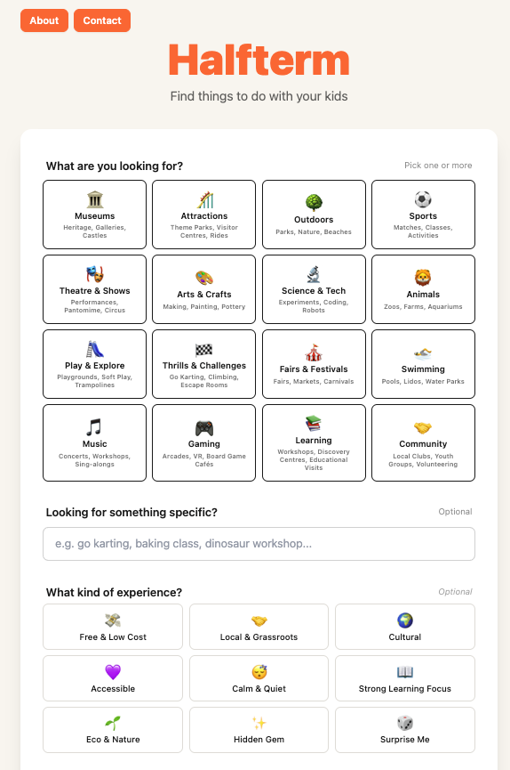
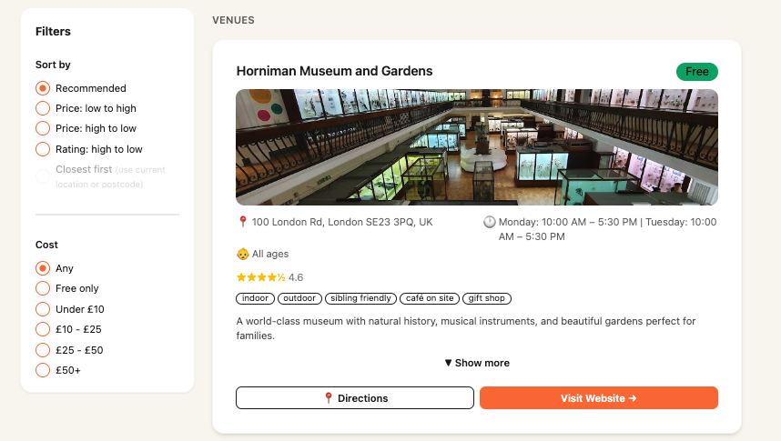

# Halfterm

**Find things to do with your kids.**

Halfterm is a family activities finder for UK parents. Search by activity type, location, date, age range and budget — and get relevant, local results powered by multiple APIs and Claude AI.

🔗 **Live app:** [halfterm.up.railway.app](https://halfterm.up.railway.app)

---

## Screenshots




---

## Features

- 🏛️ **16 activity categories** — Museums, Outdoors, Theatre & Shows, Animals, Arts & Crafts and more
- 📍 **Location search** — GPS, postcode or city, with radius filtering and distance badges
- 🗺️ **Map view** — interactive Leaflet map with venue and event pins
- 🎨 **Real images** — venue photos from Google Places, event images from Ticketmaster and Skiddle
- ⚡ **Two-stage loading** — venues appear in ~5 seconds, events follow
- 🎭 **Experience filters** — "What kind of experience?" vibes (Free & Low Cost, Accessible, Hidden Gem etc)
- 📱 **Mobile responsive** — works on phone and desktop

---

## Tech Stack

### Frontend
- React + TypeScript (Vite)
- Tailwind CSS + DaisyUI
- Leaflet (map view)
- React Router

### Backend
- Python + FastAPI
- Claude AI — Haiku model via Anthropic API
- LangChain

### APIs & Data Sources
- Google Places API — venues, opening times, photos
- Ticketmaster API — ticketed events
- Eventbrite API — community events and workshops
- Skiddle API — grassroots UK family events
- Postcodes.io — postcode to coordinates lookup

### Infrastructure
- Railway (hosting)
- Docker + Docker Compose
- GitHub Actions (CI/CD)
- Resend (contact form email)

---

## Architecture

Halfterm uses a **two-stage search** pattern for fast results:

1. User submits search → results page loads immediately with skeleton cards
2. `/search/venues` calls Google Places → venues appear (~5-8 seconds)
3. `/search/events` calls Ticketmaster, Eventbrite and Skiddle in parallel → events appear (~15-25 seconds)
4. Claude AI (Haiku) filters and formats results into structured JSON
5. Photo URLs are injected in Python after Claude responds (saves ~400 output tokens per search)

Each of the 16 categories has its own tailored search strategy — different API sources, queries and filtering rules.

---

## Running Locally

### Prerequisites
- Node.js 18+
- Python 3.11+
- API keys for: Anthropic, Google Places, Ticketmaster, Eventbrite, Skiddle, Resend

### Setup

**Clone the repo:**
```bash
git clone https://github.com/scottoswald/HalfTerm.git
cd HalfTerm
```

**Backend:**
```bash
cd backend
python -m venv venv
source venv/bin/activate
pip install -r requirements.txt
cp .env.example .env  # Add your API keys
uvicorn main:app --reload
```

**Frontend:**
```bash
cd frontend
npm install
npm run dev
```

The frontend runs on `http://localhost:5173` and the backend on `http://localhost:8000`.

### Environment Variables

Create `backend/.env` with:

```
ANTHROPIC_API_KEY=
GOOGLE_PLACES_API_KEY_BACKEND=
TICKETMASTER_API_KEY=
EVENTBRITE_API_KEY=
SKIDDLE_API_KEY=
RESEND_API_KEY=
CONTACT_EMAIL=
```

---

## Testing

```bash
# Frontend
cd frontend && npx vitest run

# Backend
cd backend && source venv/bin/activate && python -m pytest tests/ -v
```

24 frontend tests · 29 backend tests

---

## Project Status

Actively in development. Currently on **v3.5.0**.

See [CHANGELOG.md](CHANGELOG.md) for full version history.

---

## About

Built by **Scott Oswald** as a portfolio project during a career transition into software development.

- 🌐 [halfterm.up.railway.app](https://halfterm.up.railway.app)
- 💼 [linkedin.com/in/scottooswald](https://www.linkedin.com/in/scottooswald/)
- 🐙 [github.com/scottoswald](https://github.com/scottoswald)
